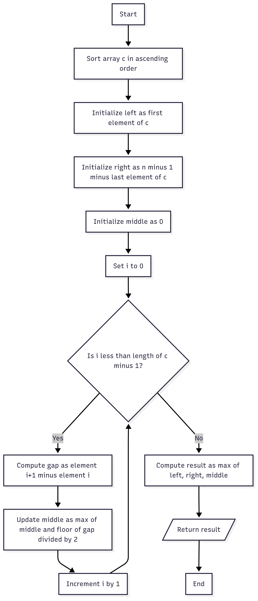
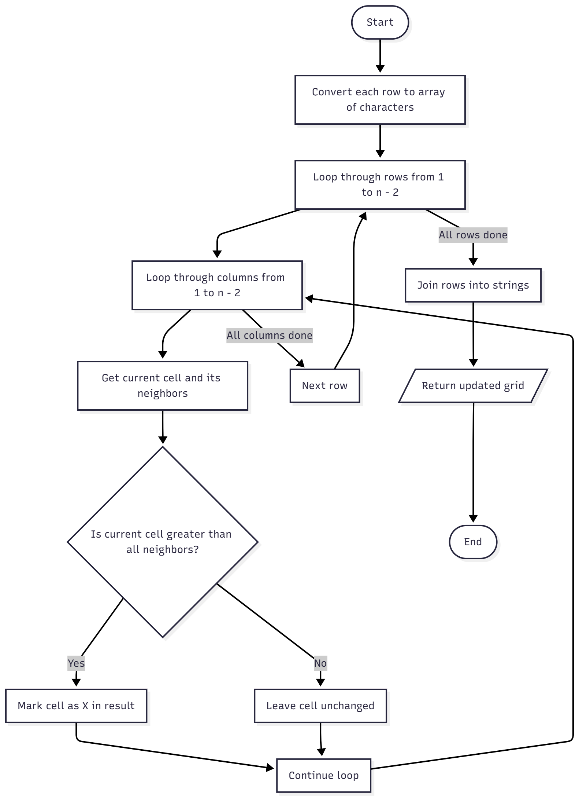

# HackerRank Practice Solutions

This repository contains my solutions to various HackerRank practice problems.  
Each problem is solved in **JavaScript**, with explanations and example outputs.

________________________________________________________________________________________________________
## Problem 1: Solve Me First  

**Description**  
Write a function that takes two integers as input and returns their sum.

**Explanation**  
The function `solveMeFirst(a, b)` simply adds the two numbers and returns the result.  
- **Input:** two integers `a` and `b`  
- **Process:** add `a` and `b`  
- **Output:** the sum of `a` and `b`  

**Flowchart**  


**Solution Code**
```javascript
function solveMeFirst(a, b) {
    return a + b;
}

let a = 2, b = 3;
console.log("The sum of", a, "and", b, "is:", solveMeFirst(a, b))
```
**Output**
The sum of 2 and 3 is: 5
________________________________________________________________________________________________________
## Problem 2: Simple Array Sum  

**Description**  
Given an array of integers, find the sum of its elements.  

**Explanation**  
The function `simpleArraySum(arr)` iterates through the array and adds each element.  
- **Input:** an array of integers, e.g., `[1, 2, 3, 4, 10, 11]`  
- **Process:** sum all the elements  
- **Output:** the total sum  

**Flowchart**  
  

**Solution Code**
```javascript
function simpleArraySum(arr) {
    let sum = 0;
    for (let num of arr) {
        sum += num;
    }
    return sum;
}

let arr = [1, 2, 3, 4, 10, 11];
console.log("The sum of the array elements is:", simpleArraySum(arr));
```
**Output**
The sum of the array elements is: 31
________________________________________________________________________________________________________
## Problem 3: Plus Minus  

**Description**  
Given an array of integers, calculate the ratios of its elements that are positive, negative, and zero. Print the decimal value of each fraction on a new line with 6 places after the decimal.  

**Explanation**  
The function `plusMinus(arr)` counts the number of positive, negative, and zero elements in the array.  
- **Input:** an array of integers, e.g., `[-4, 3, -9, 0, 4, 1]`  
- **Process:**  
  1. Initialize counters for positive, negative, and zero.  
  2. Loop through each element of the array:  
     - If element > 0 → increment positive counter.  
     - Else if element < 0 → increment negative counter.  
     - Else → increment zero counter.  
  3. Divide each counter by the array size to get ratios.  
  4. Print each ratio with 6 decimal places.  
- **Output:** three lines showing the positive ratio, negative ratio, and zero ratio.  

**Flowchart**  
  

**Solution Code**
```javascript
function plusMinus(arr){
    let negative = 0;
    let positive = 0;
    let zero = 0;
    let arraySize = arr.length;

    for(let element of arr){
        if(element > 0){
            positive++;
        }
        else if(element < 0){
            negative++;
        }else{
            zero++;
        }
    }
    let plusRatio = positive/arraySize;
    let negativeRatio = negative/arraySize;
    let zeroRatio = zero/arraySize;

    console.log(plusRatio.toFixed(6));
    console.log(negativeRatio.toFixed(6));
    console.log(zeroRatio.toFixed(6));
}

plusMinus([-4, 3, -9, 0, 4, 1]);
```
**Output**
0.500000
0.333333
0.166667
## Problem 4: Mini-Max Sum  

**Description**  
Given five positive integers, find the minimum and maximum values that can be calculated by summing exactly four of the five integers. Print the respective minimum and maximum values as a single line of two space-separated integers.  

**Explanation**  
The function `miniMaxSum(arr)` works as follows:  
- **Input:** an array of integers, e.g., `[1, 2, 3, 4, 5]`  
- **Process:**  
  1. Initialize `sum = 0`, `max = arr[0]`, `min = arr[0]`.  
  2. Loop through the array:  
     - Add each element to `sum`.  
     - Update `max` if the current number is greater.  
     - Update `min` if the current number is smaller.  
  3. Compute `minSum = sum - max` (sum of 4 smallest numbers).  
  4. Compute `maxSum = sum - min` (sum of 4 largest numbers).  
  5. Print `minSum` and `maxSum`.  
- **Output:** two space-separated integers: the minimum sum and the maximum sum.  

**Flowchart**  
  

**Solution Code**
```javascript
function miniMaxSum(arr){
    let sum = 0;
    let max = arr[0];
    let min = arr[0];

    for (let num of arr){
        sum += num;
        if(num > max){
            max = num;
        }
        if(num < min){
            min = num;
        }
    }
    let minSum = sum - max;
    let maxSum = sum - min;

    console.log(minSum, maxSum);
}

miniMaxSum([1, 2, 3, 4, 5]);
```
**Output**
10 14
## Problem 5: A Very Big Sum

**Description** 
Given in array of integers, return the sum of its elements. This problem is similar to simple array sum, but the input values can be very large.

**Explanation**
The function aVeryBigSum(arr) goes through each number in the array adds it to a running total.
- **Input**: an array of integers
- **Process**: sum all the elements
- **Output**: total sum

**Flowchart**  
  

**Solution Code**
```javascript
function aVeryBigSum(arr){
    let sum = 0;
    for(let element of arr){
        sum += element;
    }
    return sum;
}
```
**Output**
The sum of the array elements is: 5000000015
## Problem 6: Divisible Sum Pairs

**Description** 
This program finds the number of pairs in an array whose sum is evenly divisible by a given integer k

**Explanation**
1. The function takes three inputs:
    - n → the number of elements in the array.
    - k → the divisor.
    - ar → the array of integers.
2. It loops through all possible pairs (i, j) where i < j.
3. For each pair, it checks if (ar[i] + ar[j]) % k === 0.
4. If true, it increases the divisible counter.
5. Finally, it returns the total count.

**Flowchart**  
  

**Solution Code**
```javascript
function divisibleSumPairs(n, k, ar) {
    let divisible = 0;

    for (let i = 0; i < n; i++) {       
        for (let j = i + 1; j < n; j++) {
            if ((ar[i] + ar[j]) % k === 0) {   
                divisible++;
            }
        }
    }
    return divisible;
}
console.log(divisibleSumPairs(6, 3, [1, 3, 2, 6, 1, 2]));
```
**Output**
5
## Problem 7: Grading Students

**Description** 
Given an array of student grades, return the final grades after applying rounding rules. If the grade is less than 38, it remains the same. If the grade is 38 or higher, round it up to the next multiple of 5 if the difference is less than 3. Otherwise, keep the grade unchanged.

**Explanation**
The function gradingStudents(grades) goes through each grade and applies the rounding rules.
    - **Input**: an array of student grades
    - **Process**: round grades according to the conditions
    - **Output**: a new array of final grades


**Flowchart**  
  

**Solution Code**
```javascript
function gradingStudents(grades){
    let finalGrade = [];

    for(let num of grades){
        if(num < 38){
            finalGrade.push(num);
        }else{
            let nextMultiple = Math.ceil(num/5)*5;
            if(nextMultiple - num < 3){
                finalGrade.push(nextMultiple);
            }else{
                finalGrade.push(num);
            }
        }
    }
    return finalGrade;
}
```
**Output**
[75, 67, 40, 33]
## Problem 8: Bon Appetit
**Description** 
Anna and Brian are splitting a bill. If Brian overcharged Anna for an item she didn’t eat, determine if he was fair or how much he owes back.

**Explanation**
The function bonAppetit(bill, k, b) calculates Anna’s share excluding item k.
    - **Input**: array bill, index k, charged amount b
    - **Process**: compute correct share, compare with charged
    - **Output**: "Bon Appetit" or refund amount


**Flowchart**  
  

**Solution Code**
```javascript
function bonAppetit(bill, k, b) {
    let total = 0;
    for (let i = 0; i < bill.length; i++) {
        if (i !== k) {
            total += bill[i];
        }
    }
    const annaShare = total / 2;

    if (b === annaShare) {
        console.log("Bon Appetit");
    } else {
        console.log(b - annaShare);
    }
}
```
**Output**
bill = [3, 10, 2, 9], k = 1, b = 12, the result is: 5
## Problem 9: Compare Triplets

**Description**  
Given two arrays representing scores of Alice and Bob, compare their scores element by element. Alice gets a point if her score is higher, Bob gets a point if his score is higher, and no points if they are equal. Return their points as an array.

**Explanation**  
The function `compareTriplets(a, b)` loops through both arrays and compares each score.  
- **Input**: two arrays of equal length  
- **Process**: compare each element, increment Alice’s or Bob’s score  
- **Output**: array with `[Alice’s score, Bob’s score]`  

**Flowchart**  


**Solution Code**
```javascript
function compareTriplets(a, b) {
    let aCount = 0;
    let bCount = 0;

    for (let i = 0; i < a.length; i++) {
        if (a[i] > b[i]) {
            aCount++;
        } else if (a[i] < b[i]) {
            bCount++;
        }
    }

    console.log(aCount, bCount);
    return [aCount, bCount];
}
```
**Output**
input [5, 6, 7] and [3, 6, 10], the result is: [1, 1]
## Problem 10: Diagonal Different  

**Description**  
Given a square matrix, calculate the absolute difference between the sums of its primary diagonal and secondary diagonal.

**Explanation**  
The function diagonalDifference(arr) adds numbers in both diagonals and finds their absolute difference.
- **Input:** a square 2D array  
- **Process:** sum primary diagonal, sum secondary diagonal, subtract
- **Output:** absolute difference

**Flowchart**  


**Solution Code**
```javascript
function diagonalDifference(arr) {
    let n = arr.length;
    let primarySum = 0;
    let secondarySum = 0;

    for (let i = 0; i < n; i++) {
        primarySum += arr[i][i];
        secondarySum += arr[i][n - 1 - i];
    }

    return Math.abs(primarySum - secondarySum);
}
```
**Output**
[ [11, 2, 4],
  [4, 5, 6],
  [10, 8, -12] ]
The result is: 15
## Problem 11: Staircase

**Description**  
Given a number n, print a staircase of # symbols that is right-aligned.

**Explanation**  
The function staircase(n) builds each row using spaces and #.
- **Input:** integer n 
- **Process:** for each row, add spaces then add # 
- **Output:** print staircase  

**Flowchart**  


**Solution Code**
```javascript
function staircase(n) {
    for (let i = 1; i <= n; i++) {
        let row = "";

        for (let k = 0; k < n - i; k++) {
            row += " ";
        }

        for (let h = 0; h < i; h++) {
            row += "#";
        }

        console.log(row);
    }
}
```
**Output**
   #
  ##
 ###
####

## Problem 12: Time Conversion

**Description**  
Convert a 12-hour AM/PM formatted time into 24-hour military time.

**Explanation**  
The function timeConversion(s) extracts hours, minutes, seconds, and adjusts hours depending on AM/PM.
- **Input:** string in hh:mm:ssAM or hh:mm:ssPM
- **Process:** convert 12-hour to 24-hour format
- **Output:** 24-hour time string  

**Flowchart**  


**Solution Code**
```javascript
function timeConversion(s) {
    let hour = parseInt(s.slice(0, 2));
    let mins = s.slice(3, 5);
    let secs = s.slice(6, 8);
    let period = s.slice(8, 10);

    if (period === "AM") {
        if (hour === 12) {
            hour = 0;
        }
    } else {
        if (hour !== 12) {
            hour += 12;
        }
    }

    let hourStr = String(hour).padStart(2, '0');
    return `${hourStr}:${mins}:${secs}`;
}
```
**Output**
input 07:05:45PM, the result is: 19:05:45
## Problem 13: Cat and Mouse

**Description**  
Two cats and a mouse are on a line. Given their positions, determine which cat will reach the mouse first, or if the mouse escapes.

**Explanation**  
The function catAndMouse(x, y, z) compares the distances of each cat from the mouse.
- **Input:** positions of Cat A, Cat B, and Mouse C
- **Process:** compute absolute distances, compare
- **Output:** "Cat A", "Cat B", or "Mouse C"  

**Flowchart**  


**Solution Code**
```javascript
function catAndMouse(x, y, z) {
    let distA = Math.abs(x - z);
    let distB = Math.abs(y - z);

    if (distA > distB) {
        return "Cat B";
    } else if (distA < distB) {
        return "Cat A";
    } else {
        return "Mouse C";
    }
}
```
**Output**
input (1, 2, 3), the result is: Cat B
## Problem 14: Birthday Cake Candles

**Description**  
You are given an array of integers representing the heights of birthday cake candles. Your task is to determine how many of the tallest candles can be blown out.

**Explanation**  
The function birthdayCakeCandles(candles) finds the maximum height in the array and counts how many candles have that height.
- **Input:** an array of integers, e.g., [3, 2, 1, 3]
- **Process:** 
    1. Initialize max with the first element and tallest = 0.
    2. Loop through each candle height:
        - If the height is greater than max, update max and reset tallest = 1.
        - If the height is equal to max, increment tallest.
    3. Return the value of tallest.
- **Output:** the number of tallest candles.

**Flowchart**  


**Solution Code**
```javascript
function birthdayCakeCandles(candles) {
    let tallest = 0;
    let max = candles[0];
    for (let i of candles) {
        if (i > max) {
            max = i;
            tallest = 1;
        } else if (i === max) {
            tallest++;
        }
    }
    return tallest;
}

// Example
console.log(birthdayCakeCandles([3, 2, 1, 3])); 
```
**Output**
2
## Problem 15: Angry Professor

**Explanation**
The code angryProfessor is used to decide if the class will be canceled or not. It checks the arrival times of students, and if their time is less than or equal to zero, they are counted as on time. After counting, the program compares it with the required number k. If the number of students on time is less than k, it means the class is canceled, so it returns "YES". If not, the class will still continue, so it returns "NO".

**Flowchart**  

## Problem 16: Beautiful Days

**Explanation**
The beautifulDays function checks how many “beautiful days” exist between two numbers i and j. A day is considered beautiful if the difference between the day and its reversed version is evenly divisible by k. The program loops through each day in the range, reverses the number, finds the difference, and checks if it is divisible by k. If yes, it adds to the count. Finally, it returns the total number of beautiful days.

**Flowchart**  

## Problem 17: Between Two Sets

**Explanation**
The getTotalX function solves the “Between Two Sets” problem. The goal is to count how many numbers are multiples of all elements in array a and at the same time factors of all elements in array b. To do this, the code first finds the least common multiple (LCM) of array a, then finds the greatest common divisor (GCD) of array b. After that, it checks all multiples of the LCM up to the GCD. If one of these multiples divides the GCD evenly, it is counted as valid. In the end, the function returns the total count of such numbers.

**Flowchart**  

## Problem 18: Breaking Records 

**Explanation**
The breakingRecords function tracks how many times a player breaks their record for the highest and lowest scores during a season. It starts by setting the first score as both the initial minimum and maximum. Then it loops through the rest of the scores. If a score is higher than the current maximum, the maximum is updated and the count for breaking the highest record increases. If a score is lower than the current minimum, the minimum is updated and the count for breaking the lowest record increases. At the end, the function returns the two counts as an array.

**Flowchart**  

## Problem 19: Count Apple and Oranges

**Explanation**
This program is about counting how many apples and oranges land on a house. The house is between points s and t on a number line. The apple tree is at position a and the orange tree is at position b. Each fruit falls at a certain distance from its tree, which can be positive (falling to the right) or negative (falling to the left).

The code uses two loops. The first loop checks every apple. It calculates where the apple lands by adding its distance to the apple tree position. If the landing spot is inside the house range (between s and t), then the apple count increases. The same process is done for oranges in the second loop.

In the end, the program prints two numbers: the total apples that fall on the house and the total oranges that fall on the house. This way, we can know exactly how many fruits land on the house.

**Flowchart**  

## Problem 20: Counting Valleys

**Explanation**
This program counts how many valleys a hiker goes through during a hike. The function takes in the number of steps and the path, where each step is either "U" for uphill or "D" for downhill. The variable level keeps track of the hiker’s altitude, starting from sea level (0). Every time the hiker goes up, the level increases, and every time they go down, the level decreases. A valley is counted whenever the hiker comes back up to sea level after being below it. The variable valleys is used to count these occurrences. In the end, the function returns the total number of valleys crossed.

**Flowchart**  

## Problem 21: Flat Land Space Station

**Explanation**
The flatlandSpaceStations function is used to find the farthest distance a city can be from a space station. First, the function sorts the array of space stations to make it easier to calculate distances. Then, it checks the distances at the edges, which are from the first city to the first station and from the last city to the last station. After that, it loops through all the space stations to find the maximum distance between any two stations. This is done by dividing the gap between stations by two because a city in the middle will be closest to either station. Finally, the function returns the largest distance among the edges and the middle. This way, we can know the city that is farthest from a space station.

**Flowchart**  

## Problem 22: Migratory Birds

**Explanation**
The migratoryBirds function finds the most common type of bird in an array of bird sightings. First, it counts how many times each bird type appears using an object. Then, it checks which bird type has the highest frequency. If two types have the same frequency, it chooses the smaller ID. Finally, it returns the ID of the most frequent bird type. This function helps determine which bird is seen the most.

**Flowchart**  

## Problem 23: Money Spent

**Explanation**
The getMoneySpent function calculates the most money you can spend to buy one keyboard and one USB drive without going over a budget b. It goes through all possible combinations of keyboards and drives using two loops. For each combination, it checks if the total cost is within the budget and higher than the current maximum spent. If it is, it updates the maximum spent. Finally, the function returns the highest amount possible that stays under the budget, or -1 if no combination fits the budget.

**Flowchart**  

## Problem 24: Permutation Equation

**Explanation**
The permutationEquation function finds a new sequence based on a given permutation array p. For each number x from 1 to n, it first finds the position of x in the array. Then it finds the position of that position in the array. This second position is added to a result array. Finally, the function returns the array of all these positions. Essentially, it solves the problem of finding y such that p[p[y]] = x for each x.

**Flowchart**  

## Problem 25: Picking Numbers

**Explanation**
The pickingNumbers function finds the longest subarray where the difference between any two numbers is at most 1. It uses two loops: the outer loop goes through each element, and the inner loop counts how many elements are equal to the current element or one more than it. After counting, it checks if this count is greater than the current maximum length and updates it if needed. Finally, the function returns the length of the largest valid subarray. This helps determine the largest group of numbers that are close in value.

**Flowchart**  

## Problem 26: Sock Merchant

**Explanation**
The sockMerchant function counts how many pairs of socks are in an array. It uses a set to keep track of socks we have seen. For each sock in the array, it checks if the sock is already in the set. If it is, it forms a pair, increases the pair count, and removes the sock from the set. If it isn’t, the sock is added to the set. Finally, the function returns the total number of pairs. This helps quickly find matching socks without using nested loops.

**Flowchart**  

## Problem 27: Utopian Tree

**Explanation**
The utopianTree function calculates the height of a tree after n growth cycles. The tree grows in two different ways depending on the season: during spring (odd cycles), the height doubles, and during summer (even cycles), the height increases by one. The function uses a loop to apply these rules for each cycle and finally returns the tree’s height after all cycles. This helps model the tree’s alternating seasonal growth.

**Flowchart**  

## Problem 28: Viral Advertising

**Explanation**
The viralAdvertising function calculates the total number of likes an advertisement receives after n days. Each day, half of the people who receive the ad like it (rounded down), and each person who likes it shares it with three friends. The function uses a loop to repeat this process for each day, keeps a running total of likes, and finally returns the total count. This models how the ad spreads virally over time.

**Flowchart**  

## Problem 29: Cut the Stick

**Explanation**
The function cutTheSticks works by simulating the process of cutting sticks until none are left. At the beginning, it records how many sticks are still available. Then it finds the smallest stick in the array and cuts that length from all sticks. After cutting, any stick that becomes zero is removed, since it can no longer be used. This process repeats again and again: count the sticks, cut them by the smallest length, and remove the finished ones. The function keeps storing the number of sticks left before each cut into a result array. In the end, it returns that array, which shows how many sticks were present in each round of cutting. This way, the program clearly tracks the progress of reducing all sticks until they are gone.

**Flowchart**  


## Problem 30: Sequence Equation

**Explanation**
The permutationEquation(p) function finds, for each number x, the position y that satisfies the condition p[p[y]] = x. It loops through every number in the array, finds its index positions using indexOf(), and stores the results in a new array. In short, it maps each number to its corresponding position based on the permutation and returns the list of those positions.

**Flowchart**  


## Problem 31: Jumping On Clouds

**Explanation**
The jumpingOnClouds function simulates a game where a player jumps across clouds arranged in a circle. Each cloud is either safe (0) or dangerous (1), and the player starts with 100 energy points. With each jump, the player moves forward by k steps, wrapping around the array if needed. Every jump costs 1 energy, and landing on a thundercloud costs an additional 2 energy. The loop continues until the player returns to the starting cloud. By the end, the function returns the remaining energy, showing how much was lost during the journey. This code is a great example of using modular arithmetic and conditionals to simulate circular movement and penalties in a game-like scenario.

**Flowchart**  


## Problem 32: Find Digits

**Explanation**
The findDigits function counts how many digits in a number n can divide n evenly. First, it converts the number into a string and splits it into individual digits. Then, it loops through each digit, converts it back to a number, and checks two things: if the digit is not zero (to avoid division by zero), and if n is divisible by that digit. If both conditions are true, it increases a counter. After checking all digits, the function returns the final count. This is useful for understanding how many digits in a number are its own divisors.

**Flowchart**  


## Problem 33: Append And Delete

**Explanation**
The appendAndDelete function checks whether we can transform string s into string t using exactly k operations. Each operation can either delete the last character of s or append a new character to it. First, the function finds the longest common prefix between s and t, since those characters don’t need to be changed. Then, it calculates how many operations are needed to delete the extra characters from s and add the missing characters from t. If the total required operations exceed k, the answer is "No". Otherwise, it checks if the remaining operations can be used up evenly or if k is large enough to delete and rebuild the entire string. If either condition is true, it returns "Yes". This logic helps determine if the transformation is possible within the allowed number of steps.

**Flowchart**  


## Problem 34: Squares

**Explanation**
The squares function counts how many perfect square numbers exist between two integers a and b, inclusive. A perfect square is a number like 1, 4, 9, 16, etc., which is the square of a whole number.

To do this, the function first finds the smallest integer start whose square is greater than or equal to a using Math.ceil(Math.sqrt(a)). Then it finds the largest integer end whose square is less than or equal to b using Math.floor(Math.sqrt(b)). The number of perfect squares between a and b is then calculated as end - start + 1. If the result is negative (meaning no perfect squares in the range), it returns 0.

Example:
- For [3, 9]: perfect squares are 4 and 9 → returns 2
- For [17, 24]: no perfect squares → returns 0

**Flowchart**  


## Problem 35: Library Fine

**Explanation**
The libraryFine function calculates the fee for returning a library book late. It compares the actual return date (d1, m1, y1) with the expected due date (d2, m2, y2). If the book is returned on time or early, the fine is 0. If it's late by days but still within the same month and year, the fine is 15 units per day. If it's late by months but within the same year, the fine is 500 units per month. If the book is returned in a later year, the fine is a fixed 10000 units. This function uses conditional checks to apply the correct penalty based on how late the return is.

**Flowchart**  


## Problem 36: Non-Divisible Subsets

**Explanation**
The nonDivisibleSubset function finds the largest group of numbers from the array S such that no two numbers in the group add up to a multiple of k. To do this, the function first counts how many numbers leave each possible remainder when divided by k. For example, if k = 3, the possible remainders are 0, 1, and 2.

Only one number with a remainder of 0 can be included, because any two such numbers would sum to a multiple of k. Then, for each pair of remainders like 1 and 2 (since 1 + 2 = 3), the function picks the group with more elements to maximize the subset size. If k is even, it also handles the special case where i = k/2, allowing only one number from that group.

This approach ensures that the subset avoids any pair of numbers whose sum is divisible by k, while keeping the group as large as possible.

**Flowchart**  


## Problem 37: Repeated String

**Explanation**
The repeatedString function calculates how many times the letter 'a' appears in the first n characters of an infinitely repeated string s. First, it counts how many 'a' characters are in the original string s. Then, it figures out how many full copies of s fit into n characters, and how many characters are left over. It counts the 'a' characters in both the full repeats and the leftover part, then adds them together to get the final result.

Example:
- For ("aba", 10): The string repeats 3 full times (abaabaaba) plus one extra character (a) → total 'a' count is 7.
- For ("a", 1000000000000): Since every character is 'a', the result is 1000000000000.

**Flowchart**  


## Problem 38: Jumping Clouds

**Explanation**
The jumpingOnClouds function calculates the minimum number of jumps needed to reach the end of a cloud path. Each cloud is either safe (0) or dangerous (1). The player starts at the first cloud and can jump either 1 or 2 steps forward, but only onto safe clouds.

The function uses a loop to move through the array. If a 2-step jump lands on a safe cloud, it takes that jump. Otherwise, it jumps 1 step. Each jump increases the jumps counter. The loop continues until the player reaches the last cloud. Finally, the function returns the total number of jumps made.

**Flowchart**  


## Problem 39: Equalize Array

**Explanation**
The equalizeArray function finds the minimum number of deletions needed to make all elements in an array the same. It works by counting how often each number appears using a frequency object. Then, it finds the number that appears the most (maxFreq). Since we want all elements to match that most frequent number, the function subtracts maxFreq from the total number of elements. This gives the number of elements we need to delete to equalize the array.

**Flowchart**  


## Problem 40: Queens Attack

**Explanation**
This function calculates how many squares a queen can attack on an n × n chessboard, given her position and a list of obstacles. The queen moves in 8 directions: up, down, left, right, and the 4 diagonals. For each direction, the function checks how far the queen can go before hitting the edge of the board or an obstacle.

**Flowchart**  


## Problem 41: ACM Teams

**Explanation**
The acmTeam function finds the best team of two people who together know the most topics. Each person’s knowledge is represented by a binary string (like "10101"), where '1' means they know a topic and '0' means they don’t.

**Flowchart**  


## Problem 42: Taums BDay

**Explanation**
This function calculates the minimum total cost for Taum to buy b black gifts and w white gifts. Each black gift costs bc, each white gift costs wc, and converting one gift from black to white (or vice versa) costs z.topic and '0' means they don’t.

**Flowchart**  


## Problem 43: Organizing Containers

**Explanation**
This function checks whether it's possible to rearrange balls in containers so that each container holds only one type of ball. You can swap balls between containers, but you can't change the total number of balls in each container or the total number of each type.

**Flowchart**  


## Problem 44: Encryption

**Explanation**
The encryption function transforms a string into an encrypted format using a grid-based approach. It removes all spaces from the input, then arranges the characters into a grid with dimensions based on the square root of the string’s length. Finally, it reads the grid column by column to build the encrypted message.

**Flowchart**  


## Problem 45: Bigger Is Greater

**Explanation**
The biggerIsGreater function finds the next lexicographically greater string using the same characters as the input string w. If no such string exists (i.e., the input is the highest possible permutation), it returns "no answer".

**Flowchart**  


## Problem 46: Kaprekar Number

**Explanation**
The kaprekarNumbers function finds all Kaprekar numbers between p and q. A Kaprekar number is one where its square can be split into two parts that add up to the original number. For each number in the range, the function squares it, splits the result into left and right parts based on its digit length, and checks if their sum equals the original number. If so, it adds the number to the result. At the end, it prints all valid numbers or "INVALID RANGE" if none are found.

**Flowchart**  


## Problem 47: Beautiful Triplets

**Explanation**
The beautifulTriplets function counts how many beautiful triplets exist in an array. A beautiful triplet is a sequence of three numbers where each number increases by a fixed difference d. Specifically, for a number x, the triplet is (x, x + d, x + 2d).

To find these, the function loops through each number in the array and checks if both x + d and x + 2d also exist in the array. If they do, it increases the count. After checking all elements, it returns the total number of beautiful triplets found.

This approach is simple and works well for small arrays, though it uses .includes() which can be slow for large datasets.

**Flowchart**  


## Problem 48: Minimum Distance

**Explanation**
The minimumDistances function finds the minimum distance between any two equal elements in an array. It loops through the array while keeping track of the last index where each value appeared using a map. If a duplicate is found, it calculates the distance between the current index and the previous one, updating the minimum distance if it's smaller. After checking all elements, it returns the smallest distance found, or -1 if no duplicates exist. This approach is efficient and uses constant space for tracking indices, making it suitable for large arrays.

**Flowchart**  


## Problem 49: Many Games

**Explanation**
This function calculates how many video games you can buy during a sale. The first game costs p, and each next game is cheaper by d, but the price never drops below m. You have a total budget of s.

**Flowchart**  


## Problem 50: The Time In Words

**Explanation**
The timeInWords function converts a given time (in hours h and minutes m) into a spoken English phrase. For example, timeInWords(5, 45) returns "quarter to six".

**Flowchart**  


## Problem 51: Chocolate Feast

**Explanation**
This function calculates how many chocolates you can eat during a promotion. You start with money n, each chocolate costs c, and for every m wrappers you collect, you get one free chocolate.

**Flowchart**  


## Problem 52: Lisa Workbook

**Explanation**
The workbook function counts how many special problems appear in a workbook. A problem is special if its number matches the page number it appears on.

**Flowchart**  


## Problem 53: Fair Rations

**Explanation**
The fairRations function distributes loaves of bread so that everyone ends up with an even number. You can only give loaves in pairs: one to a person and one to their neighbor.

**Flowchart**  


## Problem 54: Cavity Map

**Explanation**
The cavityMap function scans a grid of digits and marks cavities—cells that are strictly greater than all four of their neighbors (top, bottom, left, right)—with an 'X'.

**Flowchart**  


## Problem 55: Manasa And Stones

**Explanation**
The stones function calculates all possible final values for a sequence of stones. Each stone adds either a or b to the total, and you must place n - 1 stones. The order of choices affects the final value.

**Flowchart**  


## Problem 56: The Grid Search

**Explanation**
The gridSearch function checks if a smaller grid P exists inside a larger grid G. It returns "YES" if P is found as a block within G, and "NO" otherwise.

**Flowchart**  


## Problem 57: Super Reduce String

**Explanation**
The superReducedString function removes adjacent pairs of matching characters from a string until no more pairs remain. If the result is empty, it returns "Empty String".

**Flowchart**  


## Problem 58: Strong Password

**Explanation**
This function checks how many characters you need to add to a password to make it strong. A strong password must:
- Be at least 6 characters long
- Include at least one digit, one lowercase letter, one uppercase letter, and one special character

**Flowchart**  


## Problem 59: Two Characters

**Explanation**
The alternate function finds the longest string that can be formed by deleting characters from s so that only two distinct characters alternate without repeating.

**Flowchart**  


## Problem 60: Caesar Cipher

**Explanation**
The caesarCipher function applies a Caesar cipher to a string s, shifting each letter forward by k positions in the alphabet. Non-letter characters stay the same.

**Flowchart**  


## Problem 61: Mars Exploration

**Explanation**
The marsExploration function counts how many characters in a received message differ from the expected repeating pattern "SOS"—used in space communication.

**Flowchart**  


## Problem 62: Hackerrank In String

**Explanation**
This function checks if the word "hackerrank" appears as a subsequence in the input string s. A subsequence means the letters appear in order, but not necessarily next to each other.

**Flowchart**  


## Problem 63: Pangrams

**Explanation**
The pangrams function checks if a sentence contains every letter of the alphabet at least once. If it does, it returns "pangram"; otherwise, "not pangram".

**Flowchart**  


## Problem 64: Weighted Uniform String

**Explanation**
This function checks whether certain weights (from queries) can be formed by uniform substrings of the input string s. A uniform substring is made of repeated identical characters, like "aaa" or "cc".
Each character has a weight:
- 'a' = 1, 'b' = 2, ..., 'z' = 26 So "aaa" has weights: 1, 2, 3 (as it repeats 'a' 1, 2, 3 times)

**Flowchart**  


## Problem 65: Separate The Numbers

**Explanation**
This function checks if a string s can be split into a sequence of increasing numbers with no leading zeros. If yes, it prints "YES" followed by the first number. Otherwise, it prints "NO".

**Flowchart**  
